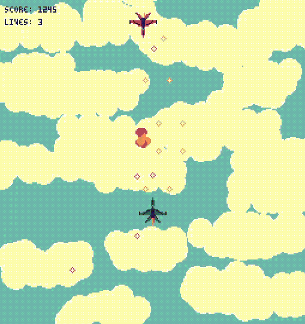

# Flask
Simple framework for 2D game development written in pure Rust. Heavily inspired by Pico-8



## Example game
[Sky Combat](https://github.com/aegis-dev/sky_combat) is an example game which aims to demonstrate capabilities and usage of the Flask game framework.

## Prerequisites
Install wasm-pack
https://rustwasm.github.io/wasm-pack/installer/

## Build
```
wasm-pack build --target web
```

## License
Flask is free software: you can redistribute it and/or modify
it under the terms of the GNU Lesser General Public License as published by
the Free Software Foundation, either version 3 of the License, or
(at your option) any later version.